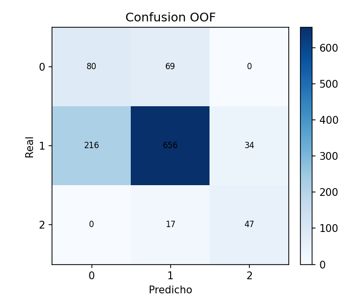
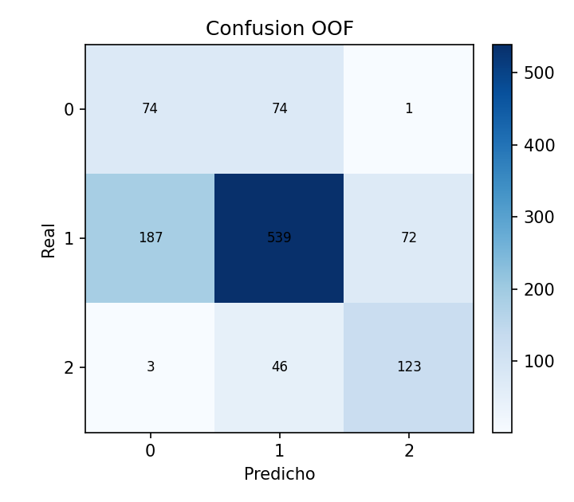

# Laboratorio 01 — Deep Learning: clasificación ordinal de GDS

**Estudiantes:** Gael Ortega y Johan Piñones · **Asignatura:** Deep Learning,
segundo semestre de 2026

## 1. Resumen y objetivos

Comparamos clasificadores nominales y ordinales para seis versiones de GDS a
partir de 15 atributos binarios. `GDS`, `GDS_R1`, …, `GDS_R5` son seis
experimentos independientes. Los cuatro métodos obligatorios son Softmax
fijo, Softmax con búsqueda interna, CORAL sin pesos y CORAL con pesos por
número efectivo. CORN y Softmax con arquitectura equiparada son controles
adicionales que pasaron la corrida definitiva. Este último entrega argmax y
mediana desde las mismas probabilidades: seis entrenamientos y siete filas
por objetivo.

La comparación principal se hace **dentro de cada objetivo**. CORAL recupera
clases minoritarias en algunos objetivos, a menudo con mayor error ordinal.
La mediana de Softmax equiparado reduce levemente MAE en `GDS`, `GDS_R1` y
`GDS_R2` sin entrenar otro modelo. Los resultados completos se congelaron en
[docs/resultados_h6](docs/resultados_h6/MANIFIESTO.md).

## 2. Dataset y variables objetivo

El archivo del curso `dataset/15 atributos R0-R5.sav` tiene 1119 filas, 15
entradas binarias y seis objetivos. El SAV no se versiona: para reproducir,
hay que colocarlo en esa ruta. Las clases originales se ordenan y recodifican
a índices `0, …, K−1`; las confusiones muestran de nuevo las clases
originales.

| Objetivo | Clases originales: número de casos |
| --- | --- |
| `GDS` | 1:149, 2:500, 3:298, 4:108, 5:42, 6:20, 7:2 |
| `GDS_R1` | 1:947, 2:150, 3:22 |
| `GDS_R2` | 1:649, 2:298, 3:172 |
| `GDS_R3` | 1:947, 3:172 |
| `GDS_R4` | 1:149, 2:906, 3:64 |
| `GDS_R5` | 1:149, 2:798, 3:172 |

Las entradas son `Día`, `Mes`, `Año`, `Estación`, `País`, `Ciudad`,
`CalleLugar`, `NumeroPiso`, `Miguel2`, `González2`, `Avenida2`, `Imperial2`,
`A682`, `Caldera2` y `Copiapo2`. El SAV y la plantilla no precisan qué
evento representa el valor 1 de cada indicador; no les atribuimos una
interpretación clínica.

Existen entradas idénticas con etiquetas distintas. En `GDS` son 97
perfiles que cubren 851 filas; en `GDS_R1`–`GDS_R5` hay 35, 73, 30, 60 y
70 perfiles ambiguos, respectivamente. Ningún clasificador determinista
basado solo en estas entradas puede resolver etiquetas contradictorias para
el mismo perfil.

## 3. Estructura del proyecto

| Ruta | Función |
| --- | --- |
| `main.py` | Entrenamiento, nested CV y ejecución por objetivo. |
| `src/config.py` | Objetivos, parámetros, grid y semillas por defecto. |
| `src/data_loader.py`, `src/preprocessing.py` | Lectura, recodificación y folds. |
| `src/models.py`, `src/losses.py`, `src/ordinal.py`, `src/methods.py` | Modelos, pérdidas y predicciones. |
| `src/evaluation.py`, `src/reporting.py` | Nueve métricas y reportes. |
| `tests/` | Pruebas de contratos, métodos y validación. |
| `results/` | Corridas locales completas; ignoradas por Git. |
| [`docs/resultados_h6/`](docs/resultados_h6/MANIFIESTO.md) | Tablas y confusiones OOF definitivas, versionadas. |

## 4. Entorno y ejecución reproducible

Con el SAV en `dataset/`, crear el entorno y ejecutar las pruebas:

```bash
conda env create -f environment.yml
conda activate lab_pytorch
python -m unittest discover -s tests -q
```

En el servidor `enterprise` pasaron 29 pruebas. El benchmark de un ajuste
de 20 épocas en un fold de `GDS_R2` dio mediana de 0,223 s en CPU y 0,428 s
en GPU para tres repeticiones; se eligió CPU con un hilo OpenMP. Comando
definitivo desde la raíz del repositorio:

```bash
OMP_NUM_THREADS=1 python main.py --data-path 'dataset/15 atributos R0-R5.sav' --all-targets --methods softmax_fixed softmax_hp coral coral_weighted corn softmax_matched --outer-folds 5 --inner-folds 3 --gds-outer-folds 2 --gds-inner-folds 2 --epochs 20 --batch-size 32 --seed 42 --device cpu --output-dir results/h6_20260923_seed42
```

En el servidor se usó `~/.envs/lab_pytorch/bin/python` y `MPLBACKEND=Agg`;
`estado.json` guarda los argumentos efectivos. Aunque el nombre de la carpeta
se había fijado para el 23/09, la ejecución terminó el **22/09/2026 a las
22:59:22 -03**. Código: commit
`4d0b6e59b3cedc6828d5007923c04d8288a187ad`. Entorno del servidor:
Python 3.10.21, PyTorch 2.14.0+cu130, NumPy 2.2.6, pandas 2.3.3,
scikit-learn 1.7.2 y pyreadstat 1.3.6. Hardware y hashes constan en el
[manifiesto](docs/resultados_h6/MANIFIESTO.md).

La ejecución produce `estado.json`, `resultados.csv`,
`configuraciones_folds.csv`, `predicciones_oof.csv`, `verificacion_oof.csv`
y reportes bajo `<método>/<objetivo>/fold_XX/`. El
[CSV versionado](docs/resultados_h6/resultados.csv) y las confusiones son
copias byte a byte de la corrida validada. Los artefactos por fold y las
predicciones individuales se reconstruyen con el comando y quedan en
`results/`.

## 5. Métodos y protocolo experimental

Softmax fijo tiene una capa oculta de 32 neuronas, ReLU, dropout 0,15 y `K`
logits. Softmax HP usa la misma familia. CORAL, CORN y Softmax equiparado
comparten un bloque oculto `15 → hidden_dim → 16` con ReLU, BatchNorm y
dropout; difieren en la cabeza, pérdida y decisión:

| Método | Aprendizaje | Decisión |
| --- | --- | --- |
| Softmax fijo / HP | `K` logits; entropía cruzada. | Argmax. |
| CORAL sin/con pesos | `K−1` logits de umbrales ordenados; BCE con logits de etiquetas acumulativas. | Contar umbrales con probabilidad mayor que 0,5. |
| CORN | `K−1` logits condicionales; BCE por umbral sobre muestras elegibles. | Producto acumulado de condicionales y conteo de umbrales. |
| Softmax equiparado | `K` logits; entropía cruzada. | Argmax y mediana de la misma distribución. |

La pérdida CORAL promedia la BCE de `K−1` umbrales por muestra. Con pesos,
`w_c=(1−β)/(1−β^{n_c})` para clases presentes, y luego se normalizan los
pesos a media uno; las ausentes reciben peso cero. Se multiplica la pérdida
de cada muestra por el peso de su clase. Los conteos provienen solo del
**train del ajuste**: inner-train durante selección y outer-train durante
reentrenamiento.

**Ejemplo numérico de CORAL.** Con `K=3`, la etiqueta original 2 es índice
1 y se codifica `[1; 0]`. Los logits `[1,3863; −1,3863]` dan sigmoides
`[0,8; 0,2]`, probabilidades de clase `[0,2; 0,6; 0,2]` y predicción de
índice 1. La BCE media es `−ln(0,8) ≈ 0,2231`. Con conteos ilustrativos
`[2; 1; 1]` y `β=0,9`, los pesos normalizados son
`[0,625; 1,1875; 1,1875]`; la pérdida de esa muestra sería
`0,2231 × 1,1875 ≈ 0,2650`. El código usa BCE con logits, sin aplicar una
sigmoide antes de la pérdida.

El grid fijado antes de H6, en orden `(hidden_dim, dropout, learning_rate,
weight_decay)`, fue `(32, 0,15, 0,001, 0,0001)`, `(64, 0,15, 0,001,
0,0001)`, `(32, 0,30, 0,001, 0,0001)` y `(32, 0,15, 0,0005,
0,0001)`. CORAL con pesos cruza esas cuatro configuraciones con
`β ∈ {0,9; 0,99; 0,999}`: 12 candidatos. Softmax fijo conserva la primera;
los otros cinco entrenamientos seleccionan menor MAE interno medio y, en
empate, mayor QWK interno medio. La mediana no tiene búsqueda ni ajuste
adicionales.

Los folds externos son compartidos. `GDS_R1`–`GDS_R5` usan 5 externos y
3 internos; `GDS` usa 2 y 2 porque la clase 7 tiene solo dos casos. En la
estratificación **interna** de `GDS` se agrupan las clases originales 6 y 7;
entrenamiento y evaluación conservan las siete etiquetas. Semilla del fold
externo: 42. Para fold externo `f` e interno `i` (desde 1), semilla de fold
interno `42+f`, entrenamiento interno `42+100f+i` y reentrenamiento sobre
todo outer-train `42+1000f`. Cada ajuste crea modelo y optimizador nuevos,
usa 20 épocas y batch 32. El outer-test solo se evalúa después de elegir la
configuración; no hubo early stopping ni búsquedas posteriores a H6.

## 6. Métricas y validación

Se reportan media y desviación estándar poblacional entre folds externos.
Las nueve métricas son accuracy (Acc), balanced accuracy (BalAcc), precisión
macro (Prec), recall macro (Rec), F1 macro (F1), MAE ordinal, kappa
ponderado cuadráticamente (QWK), exactitud a distancia máxima de una clase
(Acc±1) y fracción de errores de dos o más clases (Err≥2). MAE y Err≥2 se
minimizan; el resto se maximiza. Las métricas macro conservan la escala
completa de clases y tratan como cero una clase sin predicciones. En un
objetivo binario Err≥2 es siempre cero.

H6 terminó sin fallos: 42 filas, 189 configuraciones por fold, nueve
métricas finitas por fila, 1119 índices OOF únicos por combinación y 46 998
predicciones en total. Las probabilidades son válidas y las 42 matrices
agregadas coinciden con las predicciones. Argmax y mediana equiparados
comparten probabilidades y folds. Véanse
[cobertura](docs/resultados_h6/verificacion_oof.csv),
[configuraciones](docs/resultados_h6/configuraciones_folds.csv) y
[manifiesto](docs/resultados_h6/MANIFIESTO.md).

## 7. Resultados definitivos por objetivo

Cada celda muestra **media ± desviación** entre folds externos, redondeada a
tres decimales. El [CSV definitivo](docs/resultados_h6/resultados.csv)
contiene los valores completos. No se usa un ranking global para comparar
objetivos de distinta dificultad.

### GDS

| Método | Acc | BalAcc | Prec | Rec | F1 | MAE | QWK | Acc±1 | Err≥2 |
| --- | ---: | ---: | ---: | ---: | ---: | ---: | ---: | ---: | ---: |
| Softmax fijo | 0.541 ± 0.034 | 0.224 ± 0.021 | 0.214 ± 0.005 | 0.224 ± 0.021 | 0.205 ± 0.019 | 0.535 ± 0.044 | 0.534 ± 0.070 | 0.936 ± 0.002 | 0.064 ± 0.002 |
| Softmax HP | 0.554 ± 0.023 | 0.242 ± 0.014 | 0.211 ± 0.005 | 0.242 ± 0.014 | 0.222 ± 0.011 | 0.509 ± 0.019 | 0.602 ± 0.017 | 0.942 ± 0.006 | 0.058 ± 0.006 |
| CORAL sin pesos | 0.391 ± 0.016 | 0.384 ± 0.024 | 0.416 ± 0.019 | 0.384 ± 0.024 | 0.366 ± 0.019 | 0.709 ± 0.023 | 0.672 ± 0.007 | 0.908 ± 0.006 | 0.092 ± 0.006 |
| CORAL con pesos | 0.373 ± 0.027 | 0.434 ± 0.018 | 0.335 ± 0.030 | 0.434 ± 0.018 | 0.294 ± 0.033 | 0.735 ± 0.036 | 0.683 ± 0.002 | 0.903 ± 0.010 | 0.097 ± 0.010 |
| CORN | 0.548 ± 0.018 | 0.251 ± 0.003 | 0.240 ± 0.012 | 0.251 ± 0.003 | 0.236 ± 0.001 | 0.503 ± 0.019 | 0.643 ± 0.017 | 0.953 ± 0.001 | 0.047 ± 0.001 |
| Softmax equiparado (argmax) | 0.565 ± 0.025 | 0.338 ± 0.021 | 0.346 ± 0.004 | 0.338 ± 0.021 | 0.317 ± 0.001 | 0.483 ± 0.017 | 0.696 ± 0.018 | 0.958 ± 0.008 | 0.042 ± 0.008 |
| Softmax equiparado (mediana) | 0.567 ± 0.024 | 0.343 ± 0.034 | 0.372 ± 0.027 | 0.343 ± 0.034 | 0.329 ± 0.018 | 0.477 ± 0.018 | 0.697 ± 0.018 | 0.960 ± 0.006 | 0.040 ± 0.006 |

CORAL sin pesos consiguió F1 macro 0,366 frente a 0,222 de Softmax HP,
pero MAE 0,709 frente a 0,509: recuperar más clases tuvo un costo ordinal.
La mediana equiparada obtuvo MAE 0,477 y QWK 0,697. Hay solo dos casos de
clase 7, por lo que su recall es inestable. [Matriz OOF de Softmax equiparado
con mediana](docs/resultados_h6/matrices/softmax_matched_median/GDS.png).

### GDS_R1

| Método | Acc | BalAcc | Prec | Rec | F1 | MAE | QWK | Acc±1 | Err≥2 |
| --- | ---: | ---: | ---: | ---: | ---: | ---: | ---: | ---: | ---: |
| Softmax fijo | 0.892 ± 0.035 | 0.495 ± 0.051 | 0.516 ± 0.058 | 0.495 ± 0.051 | 0.503 ± 0.054 | 0.109 ± 0.034 | 0.613 ± 0.111 | 0.999 ± 0.002 | 0.001 ± 0.002 |
| Softmax HP | 0.892 ± 0.030 | 0.497 ± 0.041 | 0.517 ± 0.049 | 0.497 ± 0.041 | 0.505 ± 0.044 | 0.109 ± 0.030 | 0.615 ± 0.094 | 0.999 ± 0.002 | 0.001 ± 0.002 |
| CORAL sin pesos | 0.880 ± 0.011 | 0.659 ± 0.077 | 0.709 ± 0.085 | 0.659 ± 0.077 | 0.609 ± 0.088 | 0.124 ± 0.014 | 0.627 ± 0.053 | 0.996 ± 0.003 | 0.004 ± 0.003 |
| CORAL con pesos | 0.883 ± 0.015 | 0.673 ± 0.079 | 0.741 ± 0.109 | 0.673 ± 0.079 | 0.629 ± 0.104 | 0.121 ± 0.018 | 0.636 ± 0.061 | 0.996 ± 0.003 | 0.004 ± 0.003 |
| CORN | 0.896 ± 0.029 | 0.681 ± 0.070 | 0.803 ± 0.088 | 0.681 ± 0.070 | 0.721 ± 0.065 | 0.105 ± 0.030 | 0.661 ± 0.087 | 0.998 ± 0.002 | 0.002 ± 0.002 |
| Softmax equiparado (argmax) | 0.894 ± 0.022 | 0.721 ± 0.058 | 0.791 ± 0.070 | 0.721 ± 0.058 | 0.726 ± 0.038 | 0.107 ± 0.022 | 0.679 ± 0.059 | 0.999 ± 0.002 | 0.001 ± 0.002 |
| Softmax equiparado (mediana) | 0.895 ± 0.021 | 0.725 ± 0.060 | 0.795 ± 0.067 | 0.725 ± 0.060 | 0.731 ± 0.038 | 0.105 ± 0.021 | 0.685 ± 0.056 | 0.999 ± 0.002 | 0.001 ± 0.002 |

La mediana equiparada logró F1 macro 0,731 y CORN 0,721, frente a 0,505 de
Softmax HP. CORAL con pesos subió de 0,609 a 0,629 frente a CORAL sin pesos.
Softmax HP no recuperó casos de la clase 3 (22 casos), mientras CORAL con
pesos recuperó 18/22.

### GDS_R2

| Método | Acc | BalAcc | Prec | Rec | F1 | MAE | QWK | Acc±1 | Err≥2 |
| --- | ---: | ---: | ---: | ---: | ---: | ---: | ---: | ---: | ---: |
| Softmax fijo | 0.726 ± 0.036 | 0.635 ± 0.040 | 0.682 ± 0.042 | 0.635 ± 0.040 | 0.648 ± 0.038 | 0.295 ± 0.043 | 0.685 ± 0.059 | 0.979 ± 0.007 | 0.021 ± 0.007 |
| Softmax HP | 0.726 ± 0.036 | 0.638 ± 0.038 | 0.687 ± 0.039 | 0.638 ± 0.038 | 0.653 ± 0.035 | 0.293 ± 0.043 | 0.687 ± 0.059 | 0.980 ± 0.007 | 0.020 ± 0.007 |
| CORAL sin pesos | 0.729 ± 0.023 | 0.640 ± 0.030 | 0.681 ± 0.030 | 0.640 ± 0.030 | 0.637 ± 0.027 | 0.298 ± 0.034 | 0.687 ± 0.056 | 0.973 ± 0.012 | 0.027 ± 0.012 |
| CORAL con pesos | 0.723 ± 0.017 | 0.642 ± 0.031 | 0.665 ± 0.026 | 0.642 ± 0.031 | 0.636 ± 0.028 | 0.301 ± 0.030 | 0.692 ± 0.058 | 0.976 ± 0.014 | 0.024 ± 0.014 |
| CORN | 0.724 ± 0.035 | 0.648 ± 0.048 | 0.703 ± 0.041 | 0.648 ± 0.048 | 0.668 ± 0.046 | 0.289 ± 0.036 | 0.696 ± 0.042 | 0.987 ± 0.004 | 0.013 ± 0.004 |
| Softmax equiparado (argmax) | 0.732 ± 0.026 | 0.647 ± 0.031 | 0.706 ± 0.018 | 0.647 ± 0.031 | 0.667 ± 0.026 | 0.288 ± 0.028 | 0.686 ± 0.044 | 0.980 ± 0.006 | 0.020 ± 0.006 |
| Softmax equiparado (mediana) | 0.733 ± 0.037 | 0.655 ± 0.044 | 0.715 ± 0.035 | 0.655 ± 0.044 | 0.677 ± 0.041 | 0.283 ± 0.039 | 0.693 ± 0.051 | 0.984 ± 0.007 | 0.016 ± 0.007 |

La mediana equiparada dio F1 macro 0,677 y MAE 0,283; CORN 0,668 y 0,289;
Softmax HP 0,653 y 0,293. Los pesos no mejoraron F1 de CORAL (0,636
frente a 0,637). El recall de la clase original 2 fue 0,406 en Softmax HP
y 0,517 en Softmax equiparado con mediana.

### GDS_R3

| Método | Acc | BalAcc | Prec | Rec | F1 | MAE | QWK | Acc±1 | Err≥2 |
| --- | ---: | ---: | ---: | ---: | ---: | ---: | ---: | ---: | ---: |
| Softmax fijo | 0.910 ± 0.020 | 0.771 ± 0.037 | 0.857 ± 0.050 | 0.771 ± 0.037 | 0.804 ± 0.041 | 0.090 ± 0.020 | 0.610 ± 0.081 | 1.000 ± 0.000 | 0.000 ± 0.000 |
| Softmax HP | 0.910 ± 0.020 | 0.771 ± 0.037 | 0.857 ± 0.050 | 0.771 ± 0.037 | 0.804 ± 0.041 | 0.090 ± 0.020 | 0.610 ± 0.081 | 1.000 ± 0.000 | 0.000 ± 0.000 |
| CORAL sin pesos | 0.903 ± 0.024 | 0.757 ± 0.042 | 0.841 ± 0.065 | 0.757 ± 0.042 | 0.789 ± 0.048 | 0.097 ± 0.024 | 0.580 ± 0.096 | 1.000 ± 0.000 | 0.000 ± 0.000 |
| CORAL con pesos | 0.903 ± 0.024 | 0.757 ± 0.042 | 0.841 ± 0.065 | 0.757 ± 0.042 | 0.789 ± 0.048 | 0.097 ± 0.024 | 0.580 ± 0.096 | 1.000 ± 0.000 | 0.000 ± 0.000 |
| CORN | 0.904 ± 0.025 | 0.762 ± 0.058 | 0.838 ± 0.062 | 0.762 ± 0.058 | 0.791 ± 0.059 | 0.096 ± 0.025 | 0.584 ± 0.116 | 1.000 ± 0.000 | 0.000 ± 0.000 |
| Softmax equiparado (argmax) | 0.907 ± 0.022 | 0.760 ± 0.042 | 0.853 ± 0.056 | 0.760 ± 0.042 | 0.795 ± 0.048 | 0.093 ± 0.022 | 0.593 ± 0.095 | 1.000 ± 0.000 | 0.000 ± 0.000 |
| Softmax equiparado (mediana) | 0.907 ± 0.022 | 0.760 ± 0.042 | 0.853 ± 0.056 | 0.760 ± 0.042 | 0.795 ± 0.048 | 0.093 ± 0.022 | 0.593 ± 0.095 | 1.000 ± 0.000 | 0.000 ± 0.000 |

Es binario, con clases originales 1 y 3. Softmax fijo y HP empataron en F1
macro 0,804 y MAE 0,090; CORAL obtuvo 0,789 y 0,097. Argmax y mediana
de Softmax equiparado dieron las mismas predicciones.

### GDS_R4

| Método | Acc | BalAcc | Prec | Rec | F1 | MAE | QWK | Acc±1 | Err≥2 |
| --- | ---: | ---: | ---: | ---: | ---: | ---: | ---: | ---: | ---: |
| Softmax fijo | 0.831 ± 0.010 | 0.473 ± 0.039 | 0.575 ± 0.053 | 0.473 ± 0.039 | 0.491 ± 0.045 | 0.169 ± 0.010 | 0.235 ± 0.058 | 1.000 ± 0.000 | 0.000 ± 0.000 |
| Softmax HP | 0.832 ± 0.005 | 0.507 ± 0.021 | 0.544 ± 0.020 | 0.507 ± 0.021 | 0.513 ± 0.017 | 0.168 ± 0.005 | 0.283 ± 0.032 | 1.000 ± 0.000 | 0.000 ± 0.000 |
| CORAL sin pesos | 0.700 ± 0.016 | 0.665 ± 0.044 | 0.580 ± 0.017 | 0.665 ± 0.044 | 0.600 ± 0.024 | 0.300 ± 0.016 | 0.396 ± 0.032 | 1.000 ± 0.000 | 0.000 ± 0.000 |
| CORAL con pesos | 0.695 ± 0.023 | 0.656 ± 0.031 | 0.567 ± 0.022 | 0.656 ± 0.031 | 0.588 ± 0.022 | 0.306 ± 0.023 | 0.386 ± 0.024 | 0.999 ± 0.002 | 0.001 ± 0.002 |
| CORN | 0.830 ± 0.006 | 0.511 ± 0.037 | 0.528 ± 0.023 | 0.511 ± 0.037 | 0.510 ± 0.025 | 0.170 ± 0.006 | 0.287 ± 0.049 | 1.000 ± 0.000 | 0.000 ± 0.000 |
| Softmax equiparado (argmax) | 0.828 ± 0.006 | 0.514 ± 0.037 | 0.510 ± 0.013 | 0.514 ± 0.037 | 0.505 ± 0.025 | 0.172 ± 0.006 | 0.290 ± 0.051 | 1.000 ± 0.000 | 0.000 ± 0.000 |
| Softmax equiparado (mediana) | 0.828 ± 0.007 | 0.509 ± 0.040 | 0.511 ± 0.012 | 0.509 ± 0.040 | 0.503 ± 0.029 | 0.172 ± 0.007 | 0.284 ± 0.054 | 1.000 ± 0.000 | 0.000 ± 0.000 |

CORAL sin pesos elevó F1 macro a 0,600 desde 0,513 de Softmax HP y el
recall de la clase 1 a 0,537 desde 0. A cambio, MAE subió de 0,168 a
0,300. La clase 2 concentra 906 de 1119 casos; accuracy sola oculta errores
en las otras clases.



### GDS_R5

| Método | Acc | BalAcc | Prec | Rec | F1 | MAE | QWK | Acc±1 | Err≥2 |
| --- | ---: | ---: | ---: | ---: | ---: | ---: | ---: | ---: | ---: |
| Softmax fijo | 0.775 ± 0.010 | 0.513 ± 0.017 | 0.515 ± 0.017 | 0.513 ± 0.017 | 0.506 ± 0.016 | 0.225 ± 0.010 | 0.433 ± 0.030 | 1.000 ± 0.000 | 0.000 ± 0.000 |
| Softmax HP | 0.778 ± 0.009 | 0.516 ± 0.015 | 0.522 ± 0.016 | 0.516 ± 0.015 | 0.510 ± 0.015 | 0.222 ± 0.009 | 0.440 ± 0.027 | 1.000 ± 0.000 | 0.000 ± 0.000 |
| CORAL sin pesos | 0.658 ± 0.035 | 0.629 ± 0.043 | 0.576 ± 0.035 | 0.629 ± 0.043 | 0.589 ± 0.037 | 0.346 ± 0.036 | 0.496 ± 0.050 | 0.996 ± 0.003 | 0.004 ± 0.003 |
| CORAL con pesos | 0.658 ± 0.035 | 0.629 ± 0.043 | 0.576 ± 0.035 | 0.629 ± 0.043 | 0.589 ± 0.037 | 0.346 ± 0.036 | 0.496 ± 0.050 | 0.996 ± 0.003 | 0.004 ± 0.003 |
| CORN | 0.774 ± 0.009 | 0.512 ± 0.015 | 0.514 ± 0.017 | 0.512 ± 0.015 | 0.505 ± 0.012 | 0.226 ± 0.009 | 0.432 ± 0.024 | 1.000 ± 0.000 | 0.000 ± 0.000 |
| Softmax equiparado (argmax) | 0.777 ± 0.007 | 0.509 ± 0.011 | 0.523 ± 0.012 | 0.509 ± 0.011 | 0.505 ± 0.010 | 0.223 ± 0.007 | 0.428 ± 0.018 | 1.000 ± 0.000 | 0.000 ± 0.000 |
| Softmax equiparado (mediana) | 0.778 ± 0.006 | 0.510 ± 0.010 | 0.528 ± 0.011 | 0.510 ± 0.010 | 0.507 ± 0.009 | 0.222 ± 0.006 | 0.430 ± 0.017 | 1.000 ± 0.000 | 0.000 ± 0.000 |

CORAL sin pesos obtuvo F1 macro 0,589 frente a 0,510 de Softmax HP y
recall 0,497 en clase 1 frente a 0. Su MAE fue peor: 0,346 frente a
0,222. CORAL con pesos dio las mismas medias redondeadas en F1 y MAE.



## 8. Interpretación, limitaciones y conclusiones

Softmax HP frente a Softmax equiparado informa sobre la arquitectura:
comparten grid, pero no red. CORAL y CORN comparten el bloque oculto con
Softmax equiparado; sus diferencias reflejan cabeza, pérdida y decisión en
conjunto. Cada método selecciona su propia configuración interna, por lo que
estos contrastes no son efectos causales puros. CORAL con/sin pesos evalúa la
ponderación junto con una nueva selección. Argmax frente a mediana sí aísla
la regla de decisión: usan el mismo ajuste y las mismas probabilidades.

La ponderación no dio ventaja uniforme: mejoró F1 de CORAL en `GDS_R1`,
fue casi neutra en `GDS_R2` y `GDS_R5`, y lo redujo en `GDS` y `GDS_R4`.
En `GDS_R4` y `GDS_R5`, el mayor F1 de CORAL acompaña mayor MAE. No hay
un ganador único sin definir qué error importa. CORN y Softmax equiparado
también variaron por objetivo; en `GDS_R3` el baseline siguió competitivo.

Las clases escasas —sobre todo los dos casos `GDS=7`— hacen frágiles las
conclusiones por clase. Los perfiles con etiquetas contradictorias limitan
la información de las entradas. Los folds se formaron por fila; no hay
identificadores de sujeto o grupo para comprobar dependencia entre filas.
Se usó una sola semilla, sin incertidumbre entre semillas. El SAV no documenta
el significado de cada indicador. Estas limitaciones afectan la lectura de
resultados, pero no motivaron cambios en método, grid o dispositivo al ver el
test externo.

En conjunto, el laboratorio muestra por qué conviene optimizar MAE interno
y reportar varias métricas externas, no solo accuracy. El valor de una salida
ordinal depende del objetivo y del costo de los errores. El procedimiento
puede reconstruirse con el comando de la sección 4, los folds y semillas de
la sección 5 y las tablas y configuraciones versionadas. El informe de H9
se redactará en Overleaf desde este README; no forma parte de H8.
